# TP1 - Installation Linux sur une VM - V0.4 TCK-NTN

## Groupe 

1. Yazan (YAD) 		- Noé (NAM) 
2. Siméon (SAR) 	- Gaëtan (GFR)
3. Tristan (TCK) 	- Nicolas (NTN)
4. Matéo (MCN) 		- Thomas (TBT)
5. Noah (NRN) 		- Guillaume (GFE)
6. Benjamin (BSC) 	- Valentin (VBC)
7. Gabriel (GOM) 	- Nikola (NDC)

## But 

Cette manipulation a pour but d'installer une distribution Linux [Sparky Linux](https://sparkylinux.org/) dans une machine virtuelle VMware 
Workstation Player, à l'aide d'une image disque (ISO).

## Matériel à disposition 

- VMware Workstation Player - V17
- Image disque (ISO) : sparkylinux-6.4-x86_64-minimalcli.iso

> Remarque : la version réellement utilisée pour ce TP est **SparkyLinux 8.4 MinimalCLI « Seven Sisters »** (`sparkylinux-8.4-x86_64-minimalcli.iso`), basée sur **Debian 13 « trixie »** (noyau 6.12), comme on le voit sur les captures du live CD.

## Création d'une machine virtuelle 

**A.** Lancez VMware Workstation Player (logiciel)  

**B.** Sélectionnez **Create a New Virtual Machine** 

**C-A.** Placez le fichier `.iso` dans un répertoire connu : 

`C:\VosInitiales\VM\ISO`

**C-B.** Indiquez le chemin d'accès de l'image ISO comme indiqué sur l'image ci-dessous :

 

**D-A.** Choisissez un nom d'OS : `Linux - Debian 11.x` 

 

**D-B.** Nommez la machine virtuelle : `SparkyLinux-VosInitiales` 

**E.** Créez un disque virtuel -> capacité : **20GB** 

> Remarque 1 : Cocher **Store virtual disk as a single file**

 

> Remarque 2 : Ci-dessous, la configuration de la VM 

 

**F.** Lancez la machine virtuelle : **Play virtual machine** 

---

## Lancement de l'image ISO (Linux - Live CD) 

**G.** Lancement du live CD : dans le menu de démarrage de l'ISO, on choisit **SparkyLinux CLI**.

<details>
<summary>Screen du Live CD</summary>

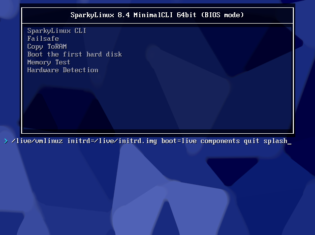 

</details>


> Shell Linux : la session `live` s'ouvre automatiquement, on arrive sur le prompt `live@live:~$`.

<details>
<summary>Screen du Shell</summary>

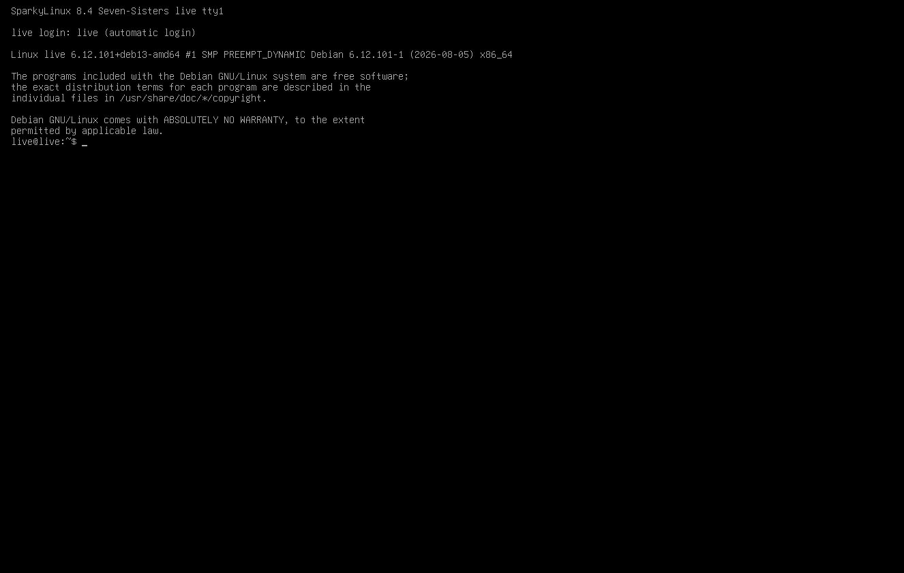

</details>


> **ATTENTION** : par défaut, le clavier est configuré en **clavier américain**

Q1. Disposition du clavier américain ?

> QWERTY

Q2. Disposition du clavier suisse romand ?

> QWERTZ

Q3. Disposition du clavier français ? 

> AZERTY

**H.** Déplacez-vous à la **racine du système** en utilisant la commande suivante : `cd` 

Q4. Votre commande ?

> `cd /`
>
> Le `/` représente la racine du système. `cd` tout seul ne va pas à la racine, il ramène dans le répertoire personnel de l'utilisateur. Donc cd / nous donne en language "humain" Change directory to root (Changer de reépertoir à la racine)

**I.** Affichez le contenu de la racine avec la commande : `ls -l`	

<details>
<summary>Screen du system root</summary>

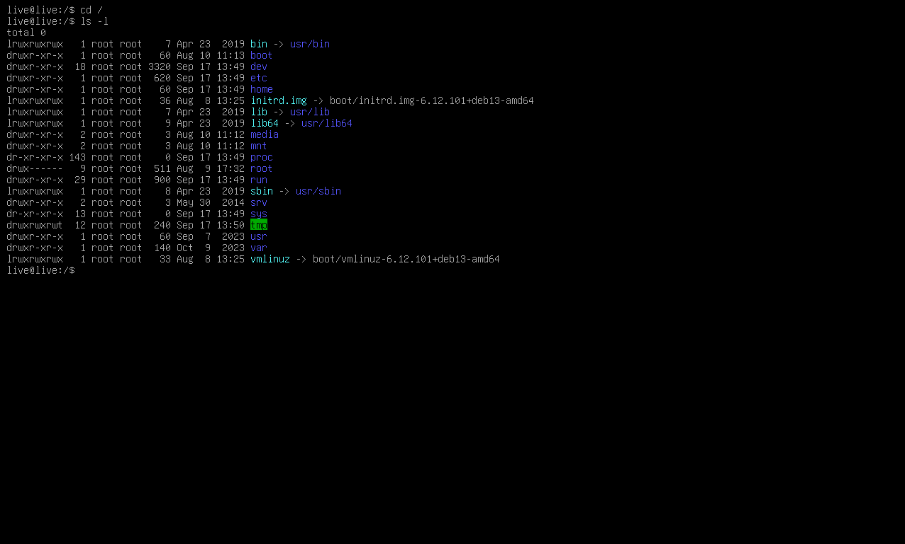

</details>


Q5. Que signifie l'option `-l` avec la commande `ls` ?

> `ls` vient de *list* : la commande liste le contenu d'un répertoire.
> L'option `-l` veut dire *long* : affichage en format long, avec une ligne par élément qui donne le type et les droits, le nombre de liens, le propriétaire, le groupe, la taille, la date de dernière modification et le nom.
>
> Sans `-l`, `ls` affiche seulement les noms, les uns à côté des autres, sans aucune information sur les droits, la taille ou la date (voir capture ci-dessous).
>
> Autres options utiles de `ls` :
> - `-a` (*all*) : affiche aussi les fichiers cachés (ceux qui commencent par un `.`)
> - `-h` (*human readable*) : avec `-l`, affiche les tailles en Ko / Mo / Go
> - `-S` : trie par taille
> - `-t` : trie par date de modification
> - `-R` : liste aussi le contenu des sous-dossiers

<details>
<summary>Capture de la commande "ls" (sans option)</summary>

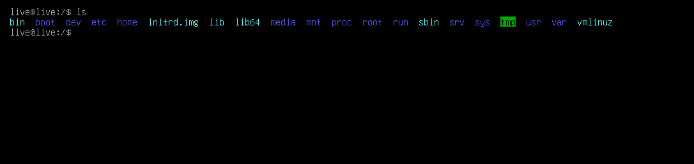 

</details>

Q6. Décryptez la ligne où se trouve le répertoire *home*    

<details>
<summary>Capture de la ligne home</summary>

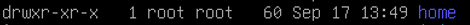 

</details>

> `drwxr-xr-x  1 root root  60 Sep 17 13:49 home`


| Champ | Valeur | Description |
|-------|--------|-------------|
| Type | `d` | Répertoire (`d` = *directory*). Un fichier normal aurait `-`, un lien symbolique `l`. |
| Droits du propriétaire (*user*) | `rwx` | Lecture (lister le contenu), écriture (créer / supprimer des fichiers dedans), exécution (entrer dans le dossier avec `cd`) |
| Droits du groupe (*group*) | `r-x` | Lecture + entrer dans le dossier, **pas d'écriture** |
| Droits des autres (*others*) | `r-x` | Lecture + entrer dans le dossier, **pas d'écriture** |
| Liens physiques | `1` | Nombre de liens. Normalement un répertoire en a 2 + 1 par sous-dossier ; le live CD utilise un système de fichiers spécial (overlay) qui affiche 1 pour les dossiers fusionnés. |
| Propriétaire | `root` | Utilisateur propriétaire (root = administrateur, UID 0) |
| Groupe | `root` | Groupe propriétaire (GID 0) |
| Taille | `60` | Taille en octets du répertoire lui-même, **pas** de son contenu |
| Date | `Sep 17 13:49` | Date et heure de la dernière modification. L'année n'est pas affichée car la date a moins de 6 mois. |
| Nom | `home` | Le répertoire `/home` |

> Conclusion : `drwxr-xr-x` : Seul **root** peut écrire dans `/home` ; un utilisateur normal peut seulement lister son contenu et y entrer.

**J.** Créez un répertoire de travail nommé « EMSY_VosInitiales » 

Q7. Dans quel dossier racine allez-vous le placer (justifiez votre réponse) ?

> Dans **`/home`**, le dossier qui contient les répertoires personnels des utilisateurs (ici `/home/live`). C'est l'endroit prévu pour les données des utilisateurs, alors que les autres dossiers de la racine sont réservés au système (`/etc` = configuration, `/bin` et `/usr` = programmes, `/dev` = périphériques, `/tmp` = temporaire…).
>
> Le plus simple est même de le créer dans son propre répertoire personnel `/home/live` (`~`) : l'utilisateur y a déjà tous les droits, pas besoin de `sudo`. Nous l'avons créé directement dans `/home`, ce qui demande les droits root (voir Q6 et Q8).

Q8. Quelle commande allez-vous utiliser pour faire ceci ?  

``` shell

cd /home
sudo mkdir EMSY_TCK_NTN

```
<details>
<summary>Tips for collapsed sections</summary>

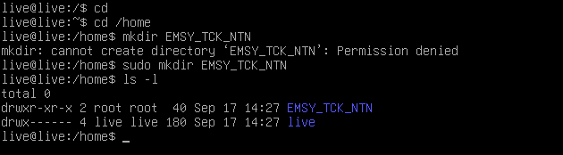

</details>


> - `mkdir` = *make directory* : crée un répertoire, suivi du nom du dossier à créer.
> - Sans `sudo`, on obtient `Permission denied` : on est connecté avec l'utilisateur normal `live` (le prompt se termine par `$`, si >il y avais `#` on aurais pas besoin du sudo car on serais en admin (root) )
> et `/home` appartient à root avec les droits `r-x` pour les autres (pas d'écriture).
> - `sudo` (*super user do*) exécute la commande avec les droits d' admin (root).
> - Conséquence : le dossier `EMSY_TCK_NTN` appartient à root (`drwxr-xr-x 2 root root`), il faudra donc aussi `sudo` pour écrire dedans.

**K.** Dans ce répertoire, créez un fichier texte que vous nommerez `TESTSLO_XXX_XXX` et éditez celui-ci en écrivant un texte, exemple : "TP linux by XXX et XXX".
	   Utilisez la commande `vi`

``` shell

cd /home/EMSY_TCK_NTN
sudo vi TESTSLO_TCK_NTN

```

> Dans `vi` : `i` (passer en mode insertion) → taper `TP linux by TCK et NTN` → `Esc` (retour au mode commande) → `:wq` puis `Entrée` (enregistrer et quitter).
> Vérification du contenu : `cat TESTSLO_TCK_NTN`

Je me suis posé la question : pourquoi `vi` et pas `nano` ?
Suite à mes recherches, j'ai trouvé que `vi` fait partie des commandes définies par la norme **POSIX** (*Portable Operating System Interface*) : il est donc présent sur pratiquement tous les systèmes Unix / Linux, même minimaux, alors que `nano` n'est pas toujours installé. [List of POSIX commands](https://en.wikipedia.org/wiki/List_of_POSIX_commands)

Q9. Pouvez-vous éditer un fichier uniquement avec la commande `vi` ?

> **NON.** 
> `sudo` était nécessaire parce que le dossier `EMSY_TCK_NTN` appartient à root ; sans `sudo`, `vi` refuse d'enregistrer (`E212: Can't open file for writing`).
>
> Remarque : avec le clavier américain sur un clavier suisse utuliser `vi` devient assez complexe.

Q10. Si vous éteignez la machine virtuelle et que vous la rallumez, est-ce que le répertoire créé ci-dessus existe toujours (justifiez votre réponse) ? 

> **Non.** Le live CD fonctionne entièrement en **RAM** : le système de l'ISO est en lecture seule et toutes les modifications (comme notre dossier) sont écrites dans un endroit temporaire (RAM). Rien n'est écrit sur le disque virtuel tant que Sparky n'est pas installé. À l'extinction, la RAM est vidée et le dossier disparaît.

**L.** Tapez la commande `ls -l /dev/sda` 

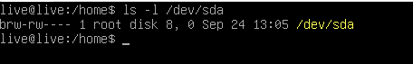

> `brw-rw---- 1 root disk 8, 0 Sep 24 13:05 /dev/sda`

Q11. Que signifie **sda** ? 

> `sda` est le **premier disque** détecté par le noyau via le pilote SCSI/SATA :
> - `s` = SCSI (aussi utilisé pour les disques SATA et USB)
> - `d` = *disk*
> - `a` = premier disque (`sdb` = deuxième, `sdc` = troisième…)
>
> Ses partitions s'appellent `sda1`, `sda2`, `sda3`… Dans notre VM, `sda` est le disque virtuel de 20 GB.

Q12. Quelle différence y a-t-il entre le répertoire de la question Q6 et celui du point L (justifiez votre réponse) ?

> - `/home` est un **vrai répertoire** (type `d`) qui contient des fichiers et des dossiers.
> - `/dev/sda` n'est pas un répertoire : c'est un **fichier spécial de périphérique en mode bloc** (type `b`). Il ne contient pas de données lui-même, il représente le disque matériel ou virtuel dans notre cas.


---

## Installation de SparkyLinux sur la VM

> **Remarque importante : j'ai par habitude et par acident j'ai mis à jour le live CD avant l'installation**

> je l'ai fais avec :
``` shell
sudo apt update
sudo apt upgrade -y
```

**M.** Installez SparkyLinux


1. Installation depuis le live CD avec l'installateur en mode texte : `sudo sparky-installer`

<details>
<summary>Tips for collapsed sections</summary>

.png)

</details>


> **(live CD mis à jour)** Cette capture montre le 1er écran de l'installateur, les écrans de l'installateur peuvent être légèrement différents de celui de mes camarade. 

Étapes de l'installation :

1. Confirmation de l'installation, choix de la langue (locales, anglais)
2. Choix du disque : `sda` (disque virtuel de 20 GB)
3. Partitionnement (*Manual*) :
   - `sda1` : `/` (racine), ext4, 10 GB
   - `sda2` : swap, 5 GB
   - `sda3` : 3ème partition, reste que stockage vide.
4. Mot de passe root (test), nom complet (test), nom de la machine (*hostname* : `test`)
5. Attendre que la VM se copie de la RAM au disque et s'installe
6. Puis redémarrer (en retirant l'ISO du lecteur CD virtuel)

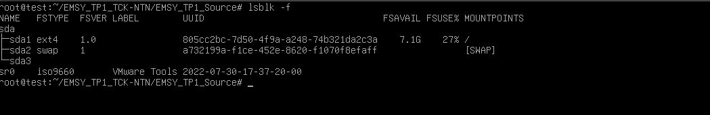

> `lsblk -f` affiche les partitions du disque `sda` et leur système de fichiers :
> - `sda1` : ext4, montée sur `/` (racine) ; 7,1 GB libres et 27 % utilisés, donc une taille d'environ 10 GB
> - `sda2` : swap (`[SWAP]` = utilisée comme espace d'échange)
> - `sda3` : aucun système de fichiers, pas montée
> - `sr0` : le lecteur CD virtuel de VMWare

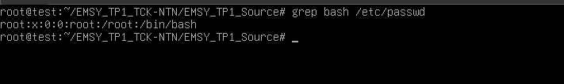

> `grep bash /etc/passwd` affiche les comptes qui utilisent le shell bash. Chaque ligne de `/etc/passwd` a 7 champs séparés par `:` :
> `root` (login) : `x` (mot de passe, stocké à part dans `/etc/shadow`) : `0` (UID) : `0` (GID) : `root` (nom complet) : `/root` (répertoire personnel) : `/bin/bash` (shell).
> Seul **root** apparaît : nous avons travaillé avec le compte root.

Q13. Quelle est la taille de disque minimum recommandée pour installer la distribution Sparky en mode CLI ?

> **15 GB** en partitionnement automatique : l'installateur l'indique (*« Auto partitioning, full disk, 15GB minimum »*, voir la capture de l'installateur au point M).

Q14. À quoi sert la partition swap ? Est-ce que ce principe existe sur les OS Microsoft Windows ? 

> La **swap** (espace d'échange) est une zone du disque utilisée comme **extension de la RAM** : quand la mémoire vive est pleine, le noyau y déplace les données (pages mémoire) les moins utilisées pour libérer de la RAM. Elle sert aussi à la mise en **veille prolongée** (hibernation) : le contenu de la RAM y est copié avant d'éteindre. Elle est beaucoup plus lente que la RAM.
>
> **Oui**, le principe existe sous Windows : c'est la **mémoire virtuelle**, mias la différence : Windows utilise un fichier, Linux utilise une partition dédiée.

Q15. Quel format pourriez-vous utiliser pour la 3ème partition afin qu'elle soit également accessible depuis un OS Microsoft ? 

> **NTFS**, le format natif de Windows, que Linux sait aussi lire et écrire.
> Autres possibilités : **exFAT** ou **FAT32**, compatibles avec tous les systèmes (FAT32 est limité à 4 GB par fichier).
> Le format ext4 utilisé par Linux n'est pas lisible par Windows sans logiciel supplémentaire.


Q16. Durant l'installation, on vous demande deux noms d'utilisateur. À quoi correspondent-ils ? 

> 1. Le **nom complet** (*full name*) : le nom réel de la personne, affiché par le système (ex. `Tristan ou Nicolas`). C'est seulement une information.
> 2. Le **nom d'utilisateur** (*username* / login) : l'identifiant pour se connecter, en minuscules et sans espaces (ex. `tristan ou nicolas ou test`). Il sert aussi à créer le répertoire personnel `/home/*username*`.

**N.** Une fois l'installation de Linux terminée, prenez une capture d'écran du démarrage de votre système (GRUB)

<details>
<summary>Screen du Grub</summary>

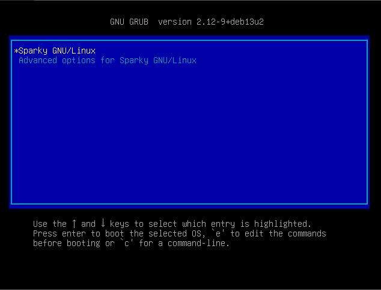

</details>

 

> Menu de GRUB 2.12 (Debian 13) au démarrage : l'entrée *Sparky GNU/Linux* démarre le système, *Advanced options* permet de choisir un autre noyau ou le mode de dépannage (*recovery*).
>
> **(live CD mis à jour)** La version affichée en haut (`2.12-9+deb13u2`) est celle du paquet GRUB après la mise à jour (`+deb13u2` = 2ème mise à jour de ce paquet dans Debian 13). De même, le noyau Linux installé est plus récent que celui du live CD : `uname -r` affiche `6.12.111+deb13-amd64`, alors que le live CD utilisait `6.12.101` (capture du point G).

<details>
<summary>Version du Noyau</summary>

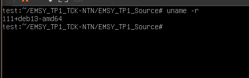

</details>


> **GRUB** (*GRand Unified Bootloader*) est le chargeur d'amorçage : il affiche le menu de démarrage, puis charge le noyau Linux (`vmlinuz`) et l'`initrd` en mémoire. C'est le premier truc qui boot après le BIOS.

**O.** Trouvez la ou les lignes de commande permettant de changer le clavier et procédez à la configuration 

```Shell
sudo dpkg-reconfigure keyboard-configuration
sudo setupcon
```

> - `dpkg-reconfigure keyboard-configuration` ouvre un menu pour choisire le clavier.
> - `setupcon` applique la nouvelle disposition à la console sans redémarrer.

<details>
  <summary>Voir les capture pour les reglage du clavier</summary>

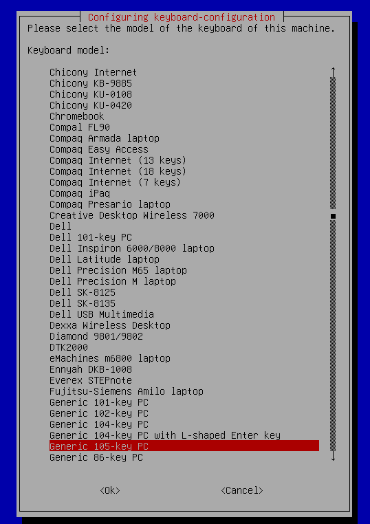

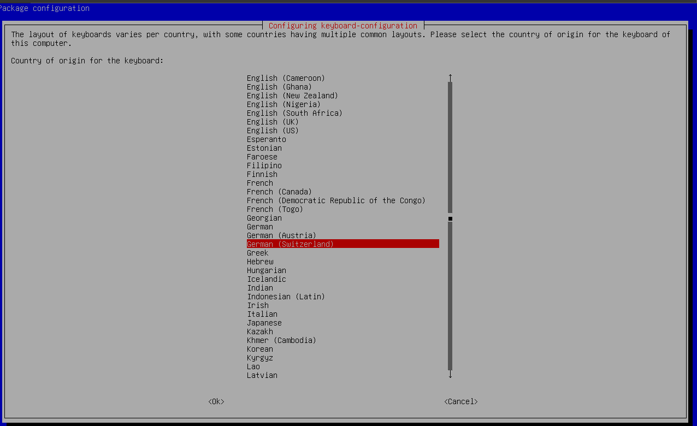

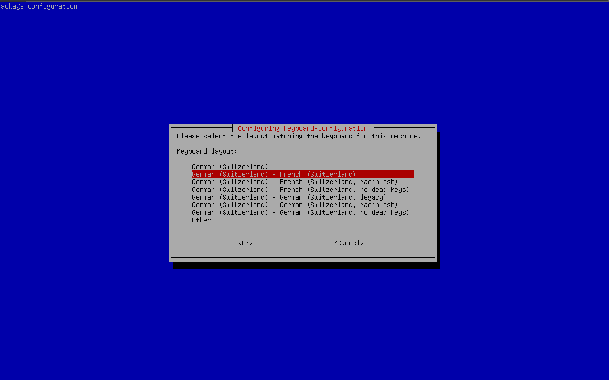

</details>

**P.** Tapez la commande : `nano -version`

<details>
<summary> Version de nano </summary>

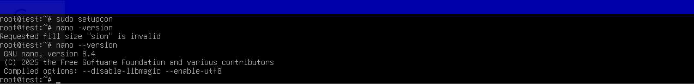 

</details>


> Remarque : `nano -version` ne fonctionne pas comme prévu. `nano` lit `-version` comme une suite d'options courtes (`-v`, `-e`, `-r sion`…) et répond `Requested fill size "sion" is invalid`. La bonne commande est **`nano --version`**, qui affiche la version installée : `GNU nano, version 8.4` (voir capture).

Q17. À quoi sert `nano` ? 

> C'est un **éditeur de texte** en mode console, comme `vi`, mais plus (beaucoup) simple : il n'a pas de modes, on écrit directement, et les raccourcis sont affichés en bas de l'écran (`^` = `Ctrl`) : `Ctrl+O` pour enregistrer, `Ctrl+X` pour quitter...

**Q.** Testez si l'application `git` est installée sur votre distribution, si ce n'est pas le cas installez un client git. 

Q18. Comment savoir si `git` est déjà installé ? 


``` shell
git --version
```

Q19. Si le client `git` n'est pas installé, quelle(s) commande(s) utilisez-vous pour l'installer ? 

``` shell
sudo apt install git
```

> `apt install git` télécharge et installe git avec ses dépendances. `sudo` est nécessaire car installer un logiciel modifie le système.

Q20. Que veut dire `apt` ? 

> **APT** = *Advanced Package Tool*. C'est le gestionnaire de paquets de Debian : il télécharge les paquets depuis les dépôts, gère les dépendances, mettre à jour (`apt upgrade` ou `apt update`) et supprimer (`apt remove`) des logiciels.

Q21. Est-ce que cette commande (`apt`) peut être utilisée sur toutes les distributions Linux (justifiez votre réponse) ? 

> **Non.** `apt` fait partie des distributions basées sur **Debian** (Debian, Ubuntu, SparkyLinux…), qui utilisent des paquets `.deb`. Les autres familles de distributions utilisent d'autres gestionnaires de paquets :
> - Fedora : `dnf` (paquets `.rpm`)
> - Arch Linux : `pacman`
> - openSUSE : `zypper`
> - Alpine : `apk`

**R.** Créez un sous-répertoire « EMSY_TP1_XXX-YYY » dans le répertoire de votre utilisateur. 
       
**Attention** : Ici on veut que l'utilisateur (vous) ait les droits de lecture, d'écriture et d'exécution.

```Shell
cd
mkdir EMSY_TP1_TCK-NTN
chmod u+rwx EMSY_TP1_TCK-NTN
ls -ld EMSY_TP1_TCK-NTN
```

> Nous étions connectés avec le compte **root** (prompt `root@test:~#`) : `cd` ramène donc dans `/root`, et le dossier créé appartient à root.
> Comme le dossier est créé par l'utilisateur dans son propre répertoire, il en est le propriétaire et a déjà les droits `rwx` (droits par défaut `drwxr-xr-x` = 755). Si on voulais donner acces a un autre utulisateur `chmod`  serais utuliser.
> `ls -ld` affiche les droits d'un dossier lui-même. Sans nom de dossier, il affiche le dossier courant : sur la capture du point S, `drwx------ 10 root root … .` correspond à `/root`.

Q22. Quel est le répertoire utilisateur ?  

> C'est le **répertoire personnel** (*home*) de l'utilisateur : `/home/*nom_utilisateur*` pour un utilisateur normal, et `/root` pour l'admin (root).
> Ici nous étions entrain de travailler avec le compte root, notre répertoire utilisateur était donc **`/root`** 

Q23. Quelles sont les commandes pour changer les droits d'utilisateurs (lecture - écriture - exécution) ?  

> - `chmod` (*change mode*) : change les droits
> - `chown` (*change owner*) : change le propriétaire (et le groupe : `chown user:groupe fichier`)
> - `chgrp` (*change group*) : change le groupe
>
> `chmod` s'utilise de deux façons :
> - **symbolique** : `u` (user), `g` (group), `o` (others), `a` (all) avec `+` (ajouter), `-` (enlever),


**S.** Dans ce répertoire, tapez la commande : `git clone https://github.com/votreDepot/EMSY_TP1_Source`

***Remarque*** : Il faut au préalable que vous ayez mis en place à cette adresse un fork du dépôt fourni lors de ce TP.

```Shell
cd ~/EMSY_TP1_TCK-NTN
git clone https://github.com/Tyuz3/EMSY_TP1_Source.git
cd EMSY_TP1_Source
ls -la
```

Q24. Qu'observez-vous dans ce répertoire ?

> Un nouveau dossier `EMSY_TP1_Source` a été créé : c'est une copie complète de notre dépôt GitHub. On y retrouve le fichier source `EMSY_TP1.c`, le dossier `Images`, les fichiers `Readme.md`, `Readme - NTN.md` et `Readme -TCK.md`, ainsi qu'un dossier caché **`.git`** (visible avec `ls -a`) qui contient tout l'historique du dépôt.
> Sur la capture, on voit aussi les commandes du point R (`mkdir`, `ls -ld`). Le premier `cd EMSYY_TP1_Source` n'a pas été completé à cause d'une faute de frappe (*No such file or directory*) : `ls` a permis de vérifier le nom exact du dossier.

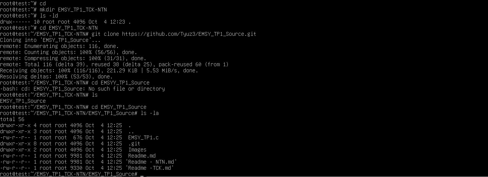

**T.** Éditez le fichier source `.c` avec l'éditeur de texte « nano ». -> Réalisez un petit programme en C (par exemple de type « Hello world »).

```Shell
nano EMSY_TP1.c
```

> Enregistrer : `Ctrl+O` puis `Entrée` ; quitter : `Ctrl+X`. ou `Ctrl+X`, `Y`, `Entée`

<details>
<summary>Screen du programe avec nano</summary>

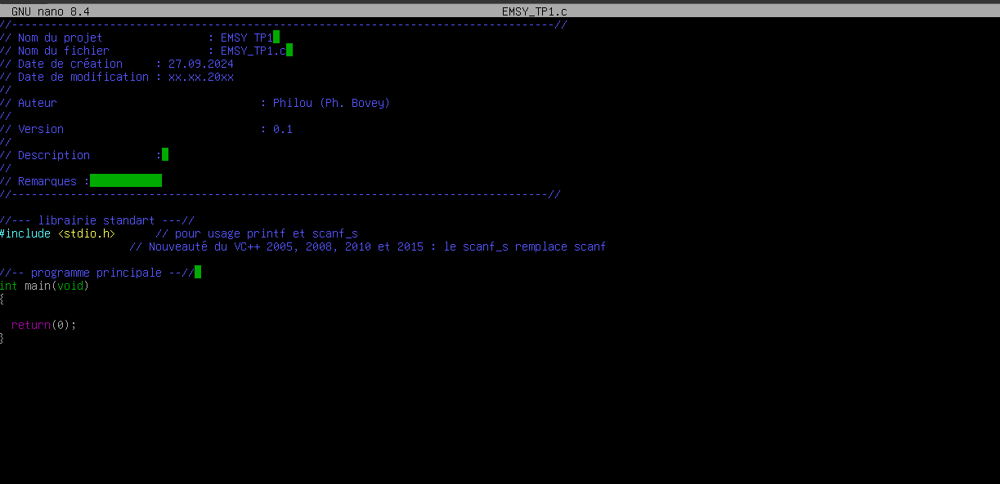

</details>

> le fichier `EMSY_TP1.c`

<details>
<summary>le fichier `EMSY_TP1.c` ouvert avec nano 8.4 (sans modification)</summary>

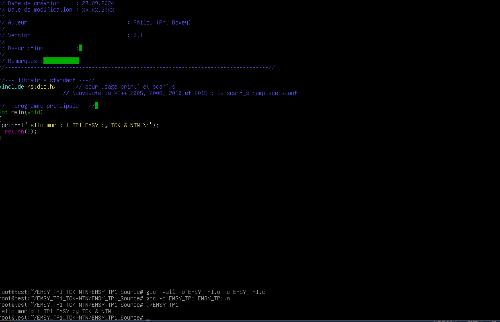
*note le proggram ici est incorrect.*

</details>


> Capture : la ligne `printf` dans le fichier avec la compilation (point U-A) et l'exécution (point V) du programme.

**U.**	Vérifiez si le compilateur `gcc` est bien installé. Notez la version du logiciel

```Shell
gcc --version
```

> Version installée : **`gcc (Debian 14.2.0-19) 14.2.0`** (voir capture).

<details>
<summary>gcc verison</summary>

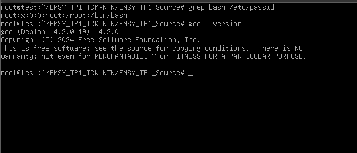

</details>


**U-A.** Tapez les commandes suivantes :
```Shell 
gcc -Wall -o fichier.o -c fichier.c 
gcc -o fichier fichier.o 
```
Remarque : « fichier » est à remplacer par le nom de votre choix

```Shell 
gcc -Wall -o EMSY_TP1.o -c EMSY_TP1.c 
gcc -o EMSY_TP1 EMSY_TP1.o 
```

<details>
<summary>Compilation</summary>

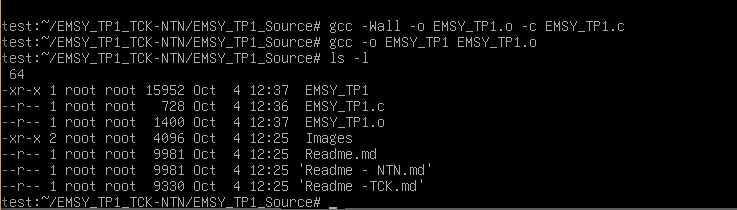

</details>


Q25. Quels sont les fichiers qui ont été générés ?

> - `EMSY_TP1.o` : le **fichier objet**, le code machine du programme.
> - `EMSY_TP1` : le **fichier exécutable** final.
>
> On le voit sur la capture du point U-A (`ls -l`) : `EMSY_TP1.o` fait 1400 octets et `EMSY_TP1` 15952 octets.

**V.** Entrez la commande suivante : `./fichier`

``` shell
./EMSY_TP1
```
<details>
<summary> Execution du programme </summary>

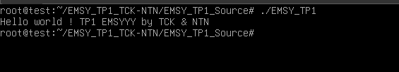

</details>


Q26. Que se passe-t-il ?

> Le programme s'exécute : il affiche `Hello world ! TP1 EMSY by TCK & NTN` puis rend la main au shell (voir la 2ème capture du point T).
> Lors de la 1ère exécution (capture ci-dessus), le texte contenait une faute de frappe (`EMSYYY`) : je l'ai corrigé le `printf` avec nano, puis recompilé avec les deux commandes `gcc` du point U-A avant de relancer le programme.

---

## Tips 

> Tip 1 : sortir de la VM -> appuyer simultanément sur `Ctrl` et `Alt` 

> Tip 2 :  
> Pour arrêter un Linux proprement : 	`shutdown` (ex. `sudo shutdown -h now`)  
> Pour forcer l'arrêt d'un système :	`halt` ou `poweroff`  
> Seul un administrateur peut exécuter ces commandes !

> Tip 3 : [commande vi avec ses options](https://www.linuxtricks.fr/wiki/guide-de-sur-vi-utilisation-de-vi)

> Tip 4 : [éditer un fichier type markdown (.md)](https://ashki23.github.io/markdown-latex.html)

